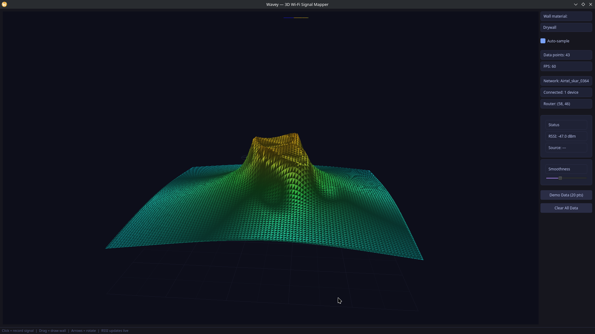

# Wavey


[]()
[]()
[]()
[]()
[]()
[]()
[]()
[]()
[]()

Real-time 3D Wi-Fi signal heatmapper. Walk around, click your position, and watch the heatmap build like a live thermal camera.



## Quick Start

```bash
python3 -m venv venv
source venv/bin/activate
pip install -r requirements.txt
python main.py
```

Click **Demo Data (20 pts)** to see the full scene immediately, or check **Auto-sample** to auto-record points.

## Features

- **3D OpenGL heatmap** — GPU-accelerated Phong-shaded surface via VisPy
- **Auto router detection** — signal-weighted centroid from your clicks
- **Connected device mapping** — live device names + positions around the router
- **Real-time RSSI** — last point updates automatically when signal changes
- **Wall drawing** — drag to add drywall, brick, or concrete obstacles
- **Scrolling waterfall** — live RSSI history overlay
- **Turntable camera** — arrow keys rotate the 3D view
- **Tokyo Night theme** — dark UI throughout

## Usage

| Action | Result |
|---|---|
| Click on floor | Record signal measurement |
| Click-drag | Draw a wall |
| Arrow keys | Rotate camera |
| Auto-sample checkbox | Auto-record every 1s |
| Demo Data button | 20 synthetic points instantly |

## Architecture

Three decoupled pipelines on separate threads:

1. **Ingestion** (`ingestion/networking.py`) — OS-level RSSI polling with automatic simulated fallback
2. **Processing** (`processing/`) — Gaussian blob kernel regression, physics path-loss model, router estimation
3. **Presentation** (`presentation/`) — PyQt6 window with VisPy OpenGL 3D canvas

## Platform Support

| OS | Method | Permissions |
|---|---|---|
| Linux | `/proc/net/wireless`, `iw`, `iwconfig` | None needed |
| Windows | `netsh wlan show interfaces` | None needed |
| macOS | `airport -I` | May be missing on Ventura+ |

## Calibration

Edit `processing/matrix_math.py`:

- **CELL_METERS** (default 0.3): real-world meters per grid cell
- **TX_POWER_DBM** (default -30.0): RSSI at 1 cell from router
